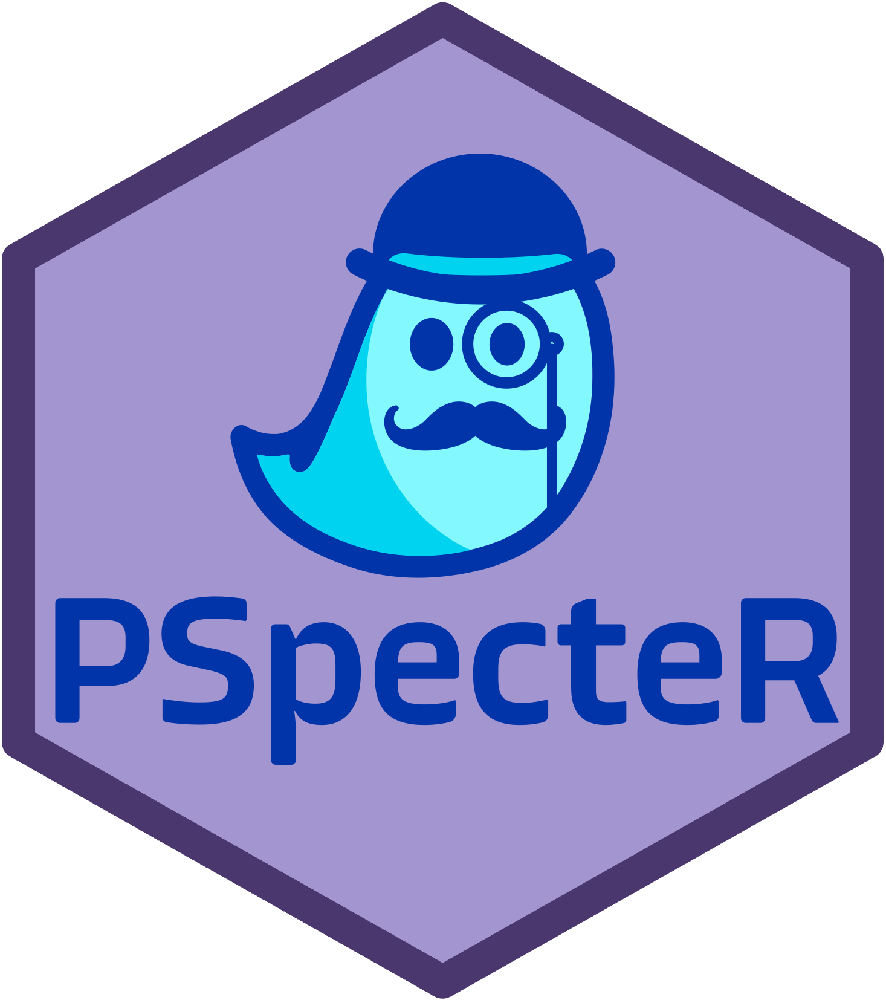

  <!-- badges: start -->
  
  <!-- badges: end -->

# The PSpecteR Library (pspecterlib)

Allows users to use the backend functionality of the PSpecteR proteomics visualization application independent of the app. 

**Highlights of PSpecteR functionality include:**

* Calculating and visualizing peptide/protein fragmentation patterns on experimental spectra 
* Generating extracted ion chromatograms (XICs)
* Mapping identified peptides to protein sequences
* Testing alternative peptides and mass modified ions  
* Visualizing output from MSPathFinderT

...for both top-down and bottom-up proteomics. 

*Inputs:* MS file (mzML or ThermoFisher raw), ID file (optional mzid), FASTA file (optional) 

# How to install 

`devtools::install_github("EMSL-Computing/pspecterlib")`

Read our vignette [here](https://emsl-computing.github.io/pspecterlib/)
